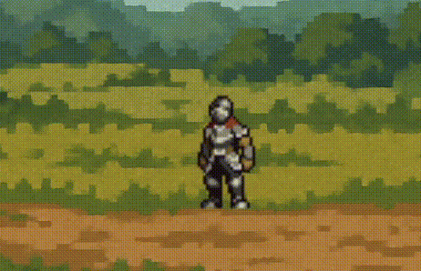
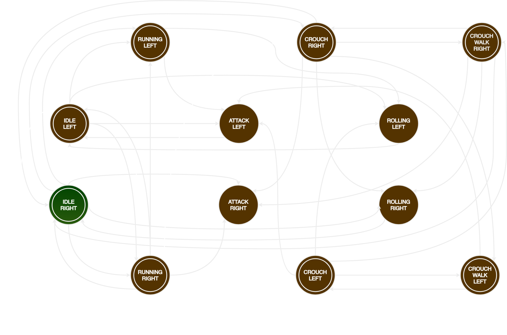

# Pixel Animation using State Machines ⚔️🛡

[](https://learn.microsoft.com/en-us/dotnet/csharp/)
[](https://www.microsoft.com/en-us/windows)


---

A **C# Windows Forms** project simulating a knight’s animation using a **State Machine**.  
An interactive experience combining **game development** and **theory of computation** — all in real time.

---

## ✨ Features

- **Smooth Knight Animations:** Idle, Running, Crouching, Rolling, Attacking
- **NFA-Based State Machine:** Transitions controlled strictly by NFA logic
- **Responsive UI:** Scales across different screen sizes
- **Toggle Visualization:** Knight animation ↔ State Diagram
- **Modular Architecture:** Clean code structure for easy maintenance and expansion

---

## 📸 Preview

### Knight Animation


### State Diagram View


> *IdleRight is the start state*

---

## 📂 Project Structure

```
PixelAnimationStateMachine/
├── Animations/
│   ├── AnimateKnight.cs             # Knight frame animations
│   ├── IAnimationController.cs      # Animation controller interface
│   └── KnightAnimationController.cs # Animation controller implementation
├── Forms/
│   ├── Form1.cs                      # Main UI logic
│   └── Form1.Designer.cs             # Auto-generated layout
├── InputHandling/
│   └── InputHandler.cs               # Input mapping and UI toggling
├── Models/
│   ├── Input.cs                      # Input actions enumeration
│   └── State.cs                      # Knight states enumeration
├── StateMachine/
│   ├── IStateMachine.cs              # State machine interface
│   └── StateMachine.cs               # State management
├── Assets/                           # Sprites, diagrams, and resources
└── Program.cs                        # Application entry point
```

---

## 🚀 Getting Started

### Requirements

- Windows OS
- .NET Framework (already included with Visual Studio builds)

### Run Instructions

1. **Download** the latest release from the [Releases](#releases) section.
2. **Unzip** the downloaded file.
3. **Open** the `Release/` folder.
4. **Launch** `PixelAnimationStateMachine.exe`.

✅ No installation needed — just launch and enjoy!

---

## 🎮 Controls

| Key         | Action                              |
|:------------|:------------------------------------|
| `A`         | Move Left                           |
| `D`         | Move Right                          |
| `C`         | Crouch                              |
| `Z`         | Roll                                |
| `V`         | Attack                              |
| `Space`     | Jump                                |
| `9`         | Toggle between Knight ↔ State Diagram View |
| `0`         | Exit Application                    |

---

## 📖 Technical Insights

This project implements **State Machines** model to govern the knight’s state transitions based on player input.  
Each input event triggers a transition, keeping behavior **predictable, structured, and mathematically sound** — mirroring real-world finite automaton behavior used in AI, language parsing, and embedded systems.

---

## 📜 License

This project is available **for educational purposes only**.

---

## 📦 Releases

- 🔖 **[Download Latest Release](https://github.com/Decr0zeath/PixelAnimationStateMachine/releases/tag/0.1.0)**

---

## 🤝 Acknowledgements

- [aamatniekss](https://aamatniekss.itch.io/) for the [Fantasy Knight - Free Pixelart Animated Character](https://aamatniekss.itch.io/fantasy-knight-free-pixelart-animated-character) 
- [Pixel Knight Gothic](https://fontstruct.com/fontstructions/show/707633/pixel_knight_gothic) font by [bluellama](https://fontstruct.com/fontstructors/162682/bleullama)
- [Dr. Cherry Lyn Sta Romana](https://ph.linkedin.com/in/cherry-lyn-sta-romana-585975113), for making me deeply understand State Machines
- [xPheRe](https://xphere.itch.io/pixel-keyboard-layout) for the Pixel Keyboard layout
- Open-source community for tools and libraries
- ChatGPT for code refactoring and analysis!

---

## 🌟 Contributing

Interested in contributing animations, enhancements, or ideas?  
Contributions are welcome! Here's how you can contribute:

1. Fork the repository
2. Create a feature branch (`git checkout -b feature/amazing-feature`)
3. Commit your changes (`git commit -m 'Add some amazing feature'`)
4. Push to the branch (`git push origin feature/amazing-feature`)
5. Open a Pull Request

Please make sure to follow the existing code style.

---
